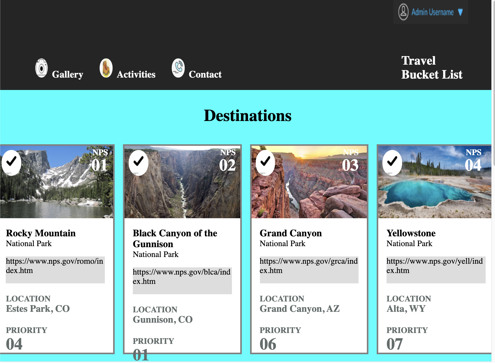

# Project Overview
> An [HTML & CSS Comp](https://nicolegooden.github.io/ng-comp-challenge-1/) by [Nicole Gooden](https://github.com/nicolegooden)

  This project required the developer to apply front-end principles to a new comp, based on a model comp.  Each file was created and modified by the developer, with a plan in mind to match the given comp.  The developer implemented a `normalize.css` file to maintain consistency across various browsers.  The CSS code utilizes flex-box properties to set the display of many HTML elements.  A media query was incorporated to make favorable display adjustments in response to users' change in screen size.  The developer's version of the comp mirrors the original comp in layout, but differs in image, text, theme, and other customizations.  

# Original Comp

# Developer Version

## Responsive Design

  A series of styling modifications are in place at a max-width of 992 pixels:

  

  ### Wins

  + Images within each article are bound to their designated space, even when the screen width increases or decreases.

  + Overflowing text within each article wraps at a breakpoint as the screen width becomes smaller, allowing the link to each National Park to stay visible to the user.  

  ### Challenges

  + The image in each article exists behind some text, shown as *NPS* and a number.  When the screen width is altered, the position of this text does not withhold its relative position.  The media query accounts for some of this change.

  + The container of *Travel Bucket List* was very difficult to manipulate.  The goal was for that text to show up toward the bottom of the container and further to the right.  While the comp was under construction, the text appeared stacked per word, rather than flexed.  This issue was resolved for the standard screen size, and will need to be resolved for small screen sizes in the future.

  ### Next Steps

  + Add media queries for small devices, such as iPhones.

  + Add media queries for very large screens, such as that of a TV.
  + Use CSS Grid for the main section of the website, so that less articles would be shown per row for smaller screens.  For instance, the standard calls for four articles in a row; two articles per row would lead to better user visibility of content.
  + Feature functional gifs to show responsive design in action.

  ### Resources

  + The Noun Project: icons
  + The National Park Service Homepage
  + The National Park Service: specific park links
  + Image from original comp: Admin Username
